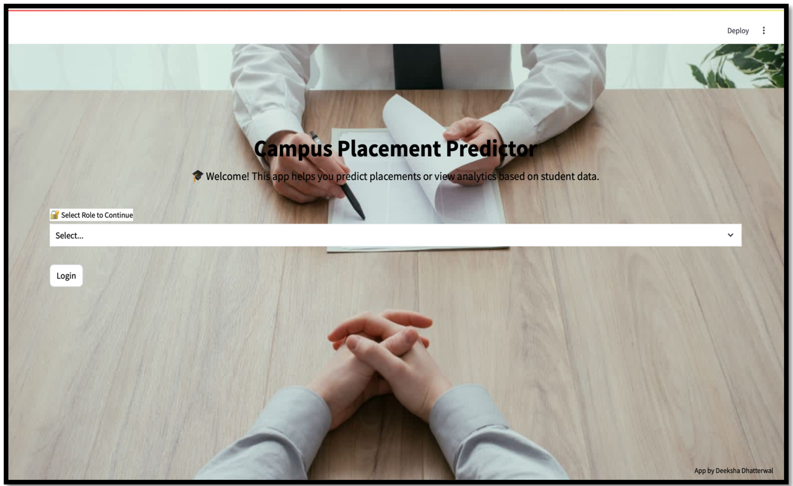
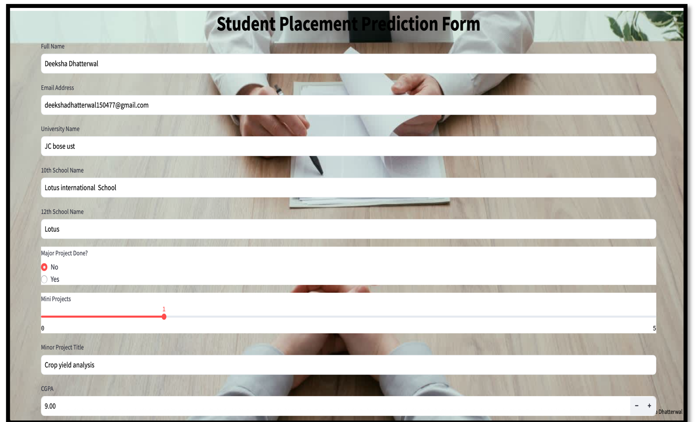
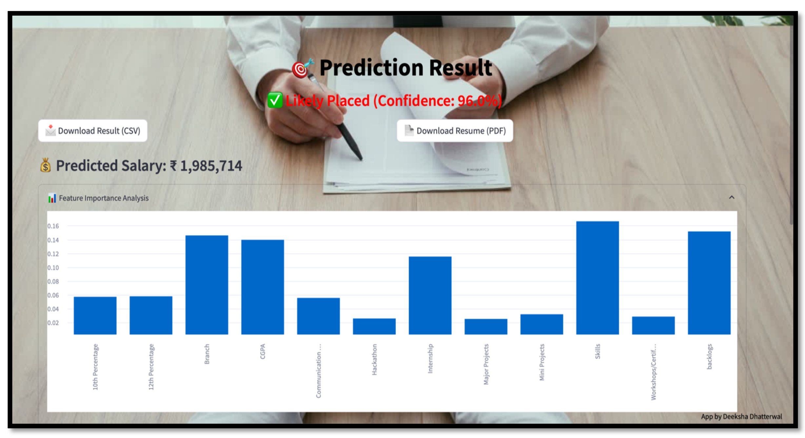
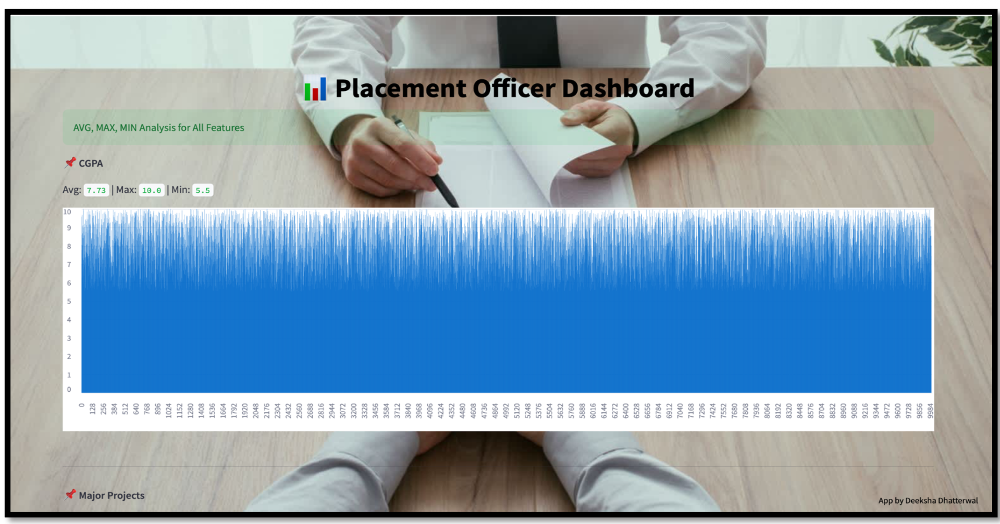

<h1 align="center">AI-Driven Placement & Salary Prediction Platform</h1>

<p align="center">
Machine Learning Web Application for Predicting Student Placement and Estimated Salary
</p>

<p align="center">


</p>

---

##  Overview

The **AI-Driven Placement & Salary Prediction Platform** is a machine learning based web application that predicts whether a student will be placed and estimates the expected salary based on academic and skill-related features.

The system helps students evaluate their placement readiness and provides analytical insights for placement officers.

---

##  Features

- Student placement prediction using Machine Learning
- Salary estimation for placed students
- Interactive **Streamlit web application**
- Feature importance visualization
- Placement officer analytics dashboard
- Resume and result download option
- Exit page chatbot for placement related queries

---

## Dataset Features

The custom dataset includes the following attributes:

- CGPA
- Major Projects
- Mini Projects
- Skills Rating
- Communication Skill Rating
- Internship Experience
- Hackathon Participation
- 10th Percentage
- 12th Percentage
- Backlogs
- Branch
- Placement Status
- Salary

---

## Machine Learning Models

- Random Forest Classifier – Predicts placement status
- Random Forest Regressor – Predicts expected salary
- LabelEncoder – Converts categorical variables into numeric form

---

## Project Workflow

1️⃣ Data Collection  
2️⃣ Data Preprocessing  
3️⃣ Exploratory Data Analysis (EDA)  
4️⃣ Feature Selection  
5️⃣ Model Training  
6️⃣ Model Evaluation  
7️⃣ Deployment using Streamlit  

---

## Application Screenshots

### Home Page


### Student Placement Prediction Form


### Prediction Result Page


### Placement Officer Dashboard


---

## ⚙️ Technologies Used

### Programming
- Python

### Libraries
- NumPy
- Pandas
- Matplotlib
- Seaborn
- Scikit-learn

### Tools
- Jupyter Notebook
- Streamlit

---

## Project Structure

```
Placement-Salary-Prediction
│
├── placementsalary.py
├── PlacementSalary.ipynb
├── dataset.csv
├── requirements.txt
├── README.md
│
└── screenshots
    ├── home_page.png
    ├── prediction_form.png
    ├── result_page.png
    └── dashboard.png
```

---

## How to Run

Clone the repository

```
git clone https://github.com/yourusername/machine-learning-projects.git
```

Install dependencies

```
pip install -r requirements.txt
```

Run the Streamlit application

```
streamlit run placementsalary.py
```

---

## Future Improvements

- Deep Learning based prediction models
- Resume skill extraction using NLP
- Company-specific placement prediction
- Real-time placement analytics

---

## Author

**Deeksha Rani**  
B.Tech Computer Engineering (Data Science)

---

If you like this project, consider giving it a star!
