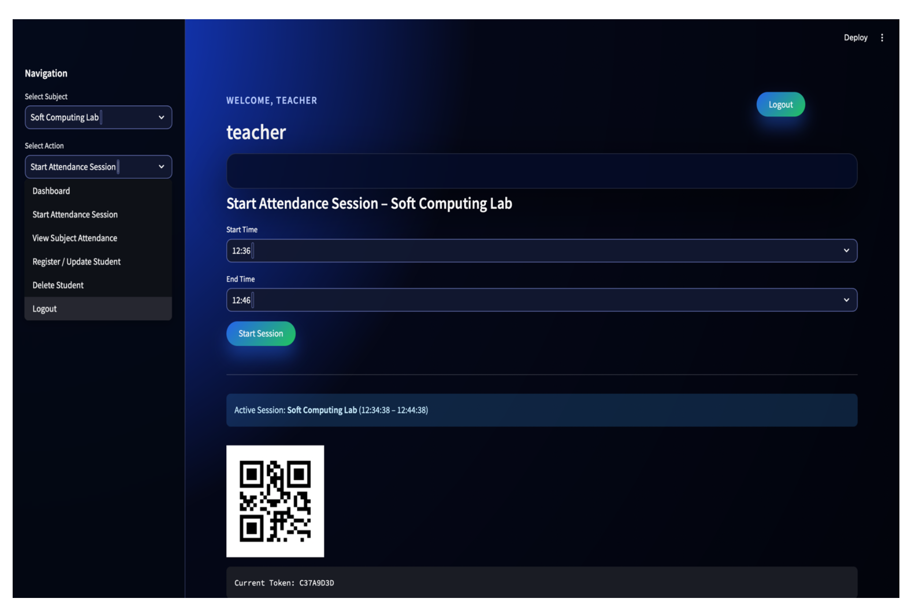
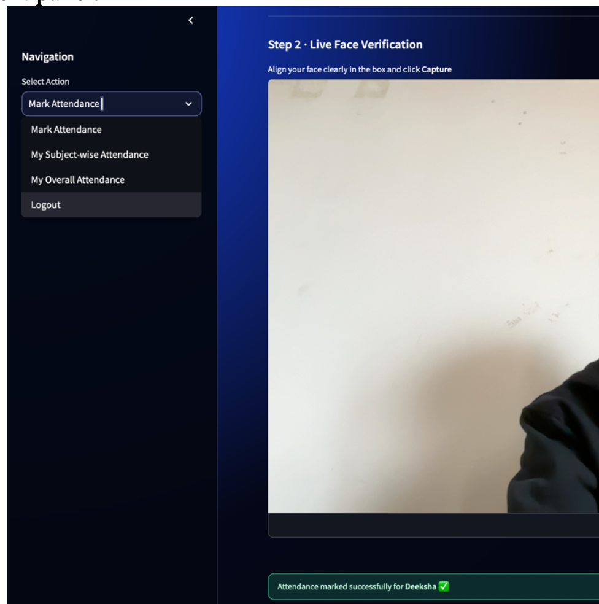
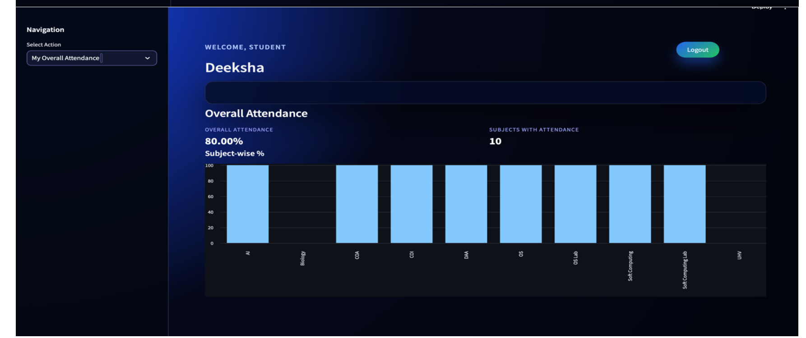

# AI-Based Smart Face Recognition Attendance System

An intelligent attendance system that uses **Face Recognition, QR Token Authentication, and Geolocation Verification** to automate and secure the attendance process.

This project eliminates problems like **proxy attendance, manual errors, and inefficient record keeping** by using Artificial Intelligence and Computer Vision.

---

## Project Overview

Traditional attendance systems rely on manual methods which are prone to errors and misuse. This project introduces a **Smart Face Recognition–Based Attendance System** that automatically verifies student attendance using multiple layers of authentication.

The system verifies attendance using:

1. QR Token Verification
2. Live Face Recognition
3. Geolocation Validation

The application is developed using **Python, OpenCV, and Streamlit**, and includes **separate dashboards for students, teachers, and coordinators**.

---

## Key Features

- Face recognition based attendance system
- QR token authentication for attendance sessions
- Live webcam-based face verification
- Geolocation validation using browser GPS
- Multi-role system
  - Student Panel
  - Teacher Panel
  - Coordinator Panel
- Attendance analytics dashboard
- Secure token generation using SHA-256
- CSV and JSON based data storage
- Proxy-free attendance verification

---

## Technologies Used

### Programming Language
- Python

### Libraries
- OpenCV
- NumPy
- Pandas
- Face Recognition (dlib)
- Streamlit
- qrcode
- hashlib
- pickle

### Development Tools
- VS Code / PyCharm
- Jupyter Notebook
- Webcam for face input

---

## System Architecture

The system verifies attendance using **three layers of authentication**.

### Layer 1 – QR Token Verification
- Teacher starts an attendance session
- A secure token is generated using timestamp and secret key
- Token is displayed as a QR code
- Students must enter the correct token

### Layer 2 – Live Face Verification
- Webcam captures student image
- Face encoding is generated
- Encoding is compared with stored encodings
- Attendance marked only if the face matches

### Layer 3 – Geolocation Verification
- Browser GPS coordinates are fetched
- Distance from classroom location is calculated
- Attendance allowed only if the student is within **150 meters**

---

## Methodology

### 1. Face Data Collection
- 2–5 images collected for each student
- Images stored in `/images/student_name/`
- Preprocessed using OpenCV

### 2. Face Encoding
- Uses **dlib 128-D face embeddings**
- Encodings stored in `encodings.pkl`
- Euclidean distance used for comparison

### 3. Attendance Verification
Attendance is recorded only when:

- QR token is correct
- Face recognition matches
- Location verification passes

### 4. Data Storage

Attendance records stored as CSV files:

```
attendance_records/subject.csv
```

Student information stored in:

```
students.json
```

---

## User Panels

### Teacher Panel
- Start attendance session
- Generate QR token
- Register or update students
- View attendance reports

### Student Panel
- Scan QR token
- Live face verification
- Mark attendance
- View attendance dashboard

### Coordinator Panel
- Monitor attendance statistics
- View subject-wise analytics
- Manage records

---

## Application Screenshots

To maintain a **clean and professional repository**, screenshots are stored inside a folder called **screenshots**.

Project maintainers or contributors should add screenshots of the application interface inside this folder.

Example screenshots to include:

- Teacher Panel
- Student Face Verification
- Student Dashboard
- Coordinator Dashboard
- QR Attendance Session

Example folder structure:

```
face_attendance_project
│
├── app.py
├── train_faces.py
├── utils.py
├── requirements.txt
├── students.json
│
├── attendance_records
│
├── images
│
└── screenshots
    ├── teacher_panel.png
    ├── register_student.png
    ├── student_verification.png
    ├── student_dashboard.png
    └── coordinator_dashboard.png
```

To display screenshots in the README, add images using:

```



```

Users should replace the image names with their own screenshots.

---

## Installation

Clone the repository

```bash
git clone https://github.com/yourusername/face-attendance-system.git
```

Navigate to project directory

```bash
cd face-attendance-system
```

Install required dependencies

```bash
pip install -r requirements.txt
```

Run the Streamlit application

```bash
streamlit run app.py
```

---

## Applications

This system can be used in:

- Colleges and Universities
- Corporate Offices
- Examination Centers
- Hostels and Mess Entry Systems
- Workshops and Seminar Attendance

---

## Future Improvements

- Integration with College ERP systems
- Voice + face recognition hybrid authentication
- AI-based anti-spoofing detection
- Mobile application for students
- Cloud storage for large datasets
- Low-light face recognition improvements

---

## Author

**Deeksha Dhatterwal**

B.Tech Computer Engineering (Data Science)

---

If you found this project useful, consider giving it a **star ⭐**.
