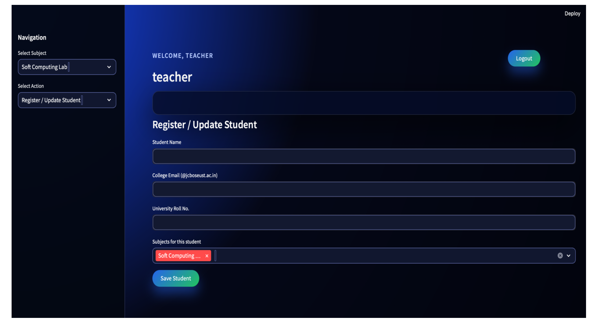
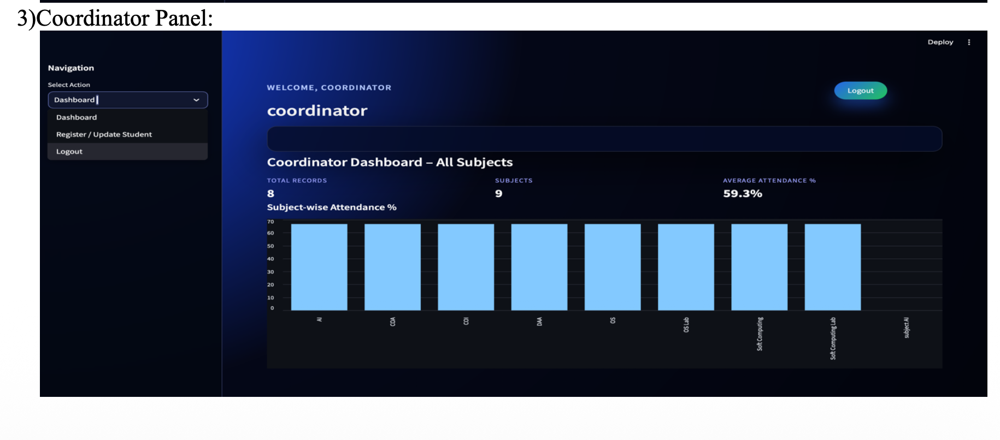

# AI-Based Smart Face Recognition Attendance System

An intelligent attendance system that uses **Face Recognition, QR Token Authentication, and Geolocation Verification** to automate the attendance process and prevent proxy attendance.

The system verifies student identity using **computer vision and machine learning** and provides **separate dashboards for students, teachers, and coordinators**.

---

# Project Overview

Traditional attendance systems rely on manual roll calls which are inefficient and allow proxy attendance.  
This project introduces a **Smart Face Recognition Attendance System** that automatically verifies student attendance using multiple security layers.

The system performs verification using:

1. QR Token Authentication
2. Live Face Recognition
3. Geolocation Validation

This ensures **secure and reliable attendance recording**.

---

# Key Features

- Face recognition based attendance system
- QR token authentication for attendance sessions
- Live webcam-based face verification
- Geolocation validation using GPS
- Multi-role system

User panels include:
- Student Panel
- Teacher Panel
- Coordinator Panel

Additional features:
- Attendance analytics dashboard
- Secure token generation using SHA-256
- CSV and JSON based data storage
- Proxy-free attendance verification

---

# Technologies Used

## Programming Language
Python

## Libraries
- OpenCV
- NumPy
- Pandas
- Face Recognition (dlib)
- Streamlit
- qrcode
- hashlib
- pickle

## Tools
- VS Code / PyCharm
- Jupyter Notebook
- Webcam for facial input

---

# System Architecture

The system verifies attendance using **three layers of authentication**.

## 1. QR Token Verification
- Teacher starts an attendance session
- A secure token is generated
- Token is converted into a QR code
- Students must enter the correct token

## 2. Live Face Verification
- Webcam captures student image
- Face encoding is generated
- Encoding is compared with stored encodings
- Attendance marked only if face matches

## 3. Geolocation Verification
- Browser GPS coordinates are fetched
- Distance from classroom location is calculated
- Attendance allowed only if student is within **150 meters**

---

# Student Face Image Dataset

For the system to recognize students, their facial images must be stored inside the **images folder**.

Each student must have a **separate folder containing their images**.

## Folder Structure

```
face_attendance_project
│
├── images
│   ├── student1
│   │   ├── img1.jpg
│   │   ├── img2.jpg
│   │   └── img3.jpg
│   │
│   ├── student2
│   │   ├── img1.jpg
│   │   ├── img2.jpg
│   │   └── img3.jpg
│
```

### Important Guidelines

- Each student must have **their own folder**
- Folder name should match the **student name or ID**
- Each folder should contain **2–5 face images**
- Images should clearly show the student's face
- Images must be stored in **JPG or PNG format**

Example:

```
images/
   ├── Deeksha
   │   ├── img1.jpg
   │   ├── img2.jpg
   │   └── img3.jpg
```

These images are used to generate **face encodings during model training**.

---

# Application Screenshots

## Teacher Panel


Teacher can start attendance sessions, generate QR tokens, and manage students.

---

## Register Student


Teachers can register new students and update their details.

---

## Live Face Verification


Students verify their identity using real-time face recognition.

---

## Student Dashboard


Students can check their attendance records and subject-wise statistics.

---

## Coordinator Dashboard


Coordinator can monitor attendance analytics and overall statistics.

---

# Installation

Clone the repository

```bash
git clone https://github.com/yourusername/face-attendance-system.git
```

Navigate to project directory

```bash
cd face-attendance-system
```

Install dependencies

```bash
pip install -r requirements.txt
```

Run the application

```bash
streamlit run app.py
```

---

# Project Structure

```
face_attendance_project
│
├── app.py
├── train_faces.py
├── utils.py
├── requirements.txt
├── students.json
│
├── encoded_faces
│   └── encodings.pkl
│
├── images
│   └── student folders
│
├── attendance_records
│   └── subject.csv
│
└── screenshots
    ├── teacher_panel.png
    ├── register_student.png
    ├── student_verification.png
    ├── student_dashboard.png
    └── coordinator_dashboard.png
```

---

# Applications

This system can be used in:

- Colleges and Universities
- Corporate Offices
- Examination Centers
- Hostels and Mess Entry Systems
- Workshops and Seminars

---

# Future Improvements

- Integration with College ERP systems
- Mobile application for students
- AI-based anti-spoofing detection
- Cloud storage for large datasets
- Low-light face recognition improvements

---

# Author

**Deeksha Dhatterwal**

B.Tech Computer Engineering (Data Science)

---

If you found this project useful, consider giving it a **star ⭐**
